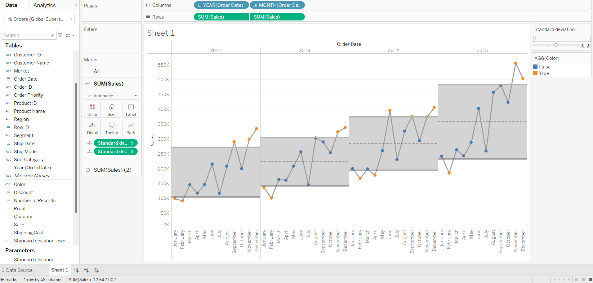

Standard Deviation and Control Charts in Tableau

Standard deviation is used to show how far away data is from the mean. This is important because when data deviates significantly from the mean, it may indicate a random event or erroneous data. Standard deviation is often used to identify outliers or spikes in the data for further analysis.

A control chart leverages standard deviations above and below the mean, displaying them as a band around the mean. Outliers are identified using color. The band width in the control chart can be multiples of the standard deviation, typically ranging from 1 to 3, since approximately 95% of values fall within 2 standard deviations of the mean.

Example: Airbnb Price Analysis

In the following example, we analyze Airbnb data to examine price spikes for different room types across the year. We also incorporate a control parameter, allowing users to adjust the standard deviation range on the graphs and highlight outliers with a color indicator.

Step One: Create the Base Chart

To visualize the price trends over months for different room types:

Drag the 'Room Type' dimension and the 'Price' (Average) measure onto the row shelf.

Place the 'Last Review' (Date as Month) dimension on the column shelf.

Step Two: Layer to Create Two Chart Types

Duplicate and dual-axis the Price measure.

Synchronize the axes and hide the right-side header.

Change the second chart type to Circle to display data points.

Edit the right axis and uncheck Show Zero to better visualize variations.

Add an Average Line from the Analytics pane (per Pane) to show a mean per room type.

Step Three: Create the Control Parameter

Create a Control Parameter, 'Choose SD':

Data Type: Integer

Range: 1 to 3

Step: 0.1

Format: 1 decimal place

Right-click on the control parameter pill and select Show Parameter Control to enable user interaction.

Step Four: Create the Upper and Lower Bound Calculated Fields

Create two calculated fields for the upper and lower bounds of the graph bands:

Upper Bound:

WINDOW_AVG(AVG([Price])) + ([Choose SD] * WINDOW_STDEV(AVG([Price])))

Lower Bound:

WINDOW_AVG(AVG([Price])) - ([Choose SD] * WINDOW_STDEV(AVG([Price])))

Note: We use the sample standard deviation (STDEV) instead of population standard deviation (STDEVP) unless working with an entire population dataset.

Step Five: Add the Reference Bands

Drag the Upper Bound and Lower Bound calculated fields to the Details Shelf.

Open the Analytics Pane and drag Reference Band onto the chart.

Set the reference band to use the Upper Bound and Lower Bound fields.

Step Six: Color the Control Chart

To highlight outliers, create a calculated field for color grouping:

IF AVG([Price]) > [Upper Bound] THEN "Outlier"
ELSEIF AVG([Price]) < [Lower Bound] THEN "Outlier"
ELSE "Normal"
END

Drag this field onto the Color Shelf on the second Circle marks card to visually differentiate outliers.

Building the Control Chart: Key Considerations

When building this Control Chart, a few critical factors were considered:

A dual-axis chart was needed to allow the dots on the line to be colored differently.

A grey zone (standard deviation) was added around the average for each year.

The grey zone was made dynamic using a parameter to adjust the standard deviation range.

Setting Up the Worksheet

Start with a basic line chart:

Add a discrete year pill and month pill to the columns shelf.

Add sum of sales to the rows.

Duplicate the sum of sales on the rows shelf.

Convert the duplicate into a circle using the Marks card.

Create a dual-axis chart and synchronize the axes.

Defining Standard Deviation Limits with Calculated Fields

Since distribution bands wouldn't allow dynamic adjustments, calculated fields were used instead:

Upper Limit: WINDOW_AVG(AVG([Sales])) + ([Choose SD] * WINDOW_STDEV(AVG([Sales])))

Lower Limit: WINDOW_AVG(AVG([Sales])) - ([Choose SD] * WINDOW_STDEV(AVG([Sales])))

These calculations were added to the Details Shelf and configured in Edit Table Calculation.

Applying Reference Lines

Drag Reference Bands from the Analytics menu onto the chart.

Use the Upper Limit and Lower Limit calculations as boundaries.

The only difference between the standard deviation upper and lower bands is the fill below is white for the lower band.

Making the Band Dynamic

Create a Parameter named Choose SD.

Adjust the lower and upper limit calculations to multiply WINDOW_STDEV by Choose SD.

Now, modifying the parameter adjusts the band width dynamically.

Coloring Outliers

Create a calculated field to classify outliers:

IF SUM([Sales]) > [Upper Limit] THEN "Outlier"
ELSEIF SUM([Sales]) < [Lower Limit] THEN "Outlier"
ELSE "Normal"
END

Drag this field onto the Color Shelf for the Circle Marks Card.

Final Enhancements

Added an average line for reference in each pane.

The final output now dynamically adjusts based on the Choose SD slider.

Key Insights

Prices for shared rooms spike in December and March, likely due to holiday seasons (Christmas, New Year, and Easter).

Businesses can use control charts to detect spikes in other domains, such as customer service calls, financial transactions, or website traffic anomalies.

